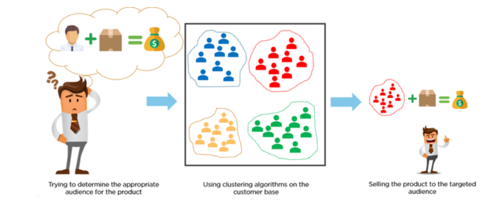
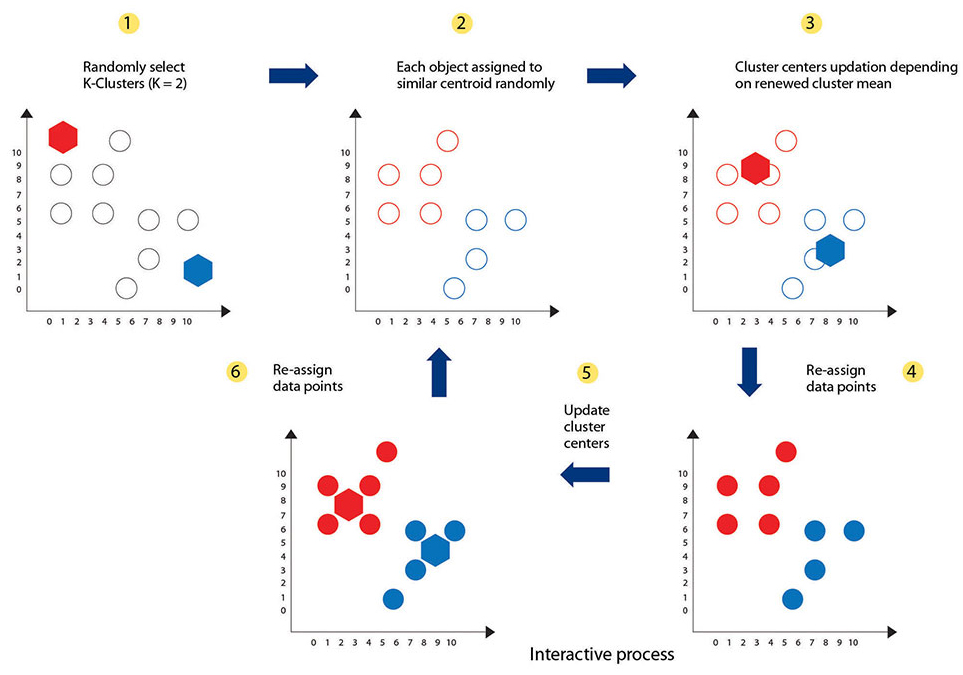
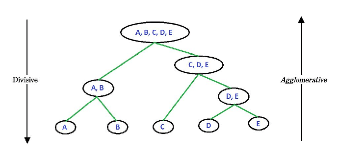
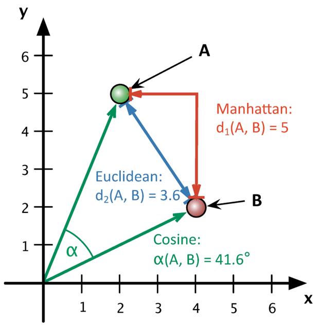
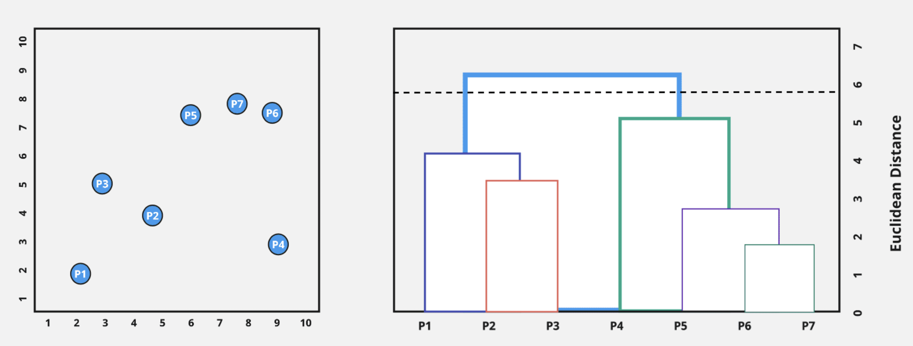

```{r setup, include=FALSE}
knitr::opts_chunk$set(echo = TRUE, message = FALSE)
# include R packages here
library(dplyr)
library(ggplot2)
```

# Introduction

Nowadays, most industries are driven by customer behavior and data analysis. For any organization, the two factors help decide the budget, marketing schemes, and promotional campaigns and help move toward a lucrative direction. For example, suppose you work for a fashion online retail store and would like to decide the discount offers to target different types of customers to boost sales. It would be beneficial to have a tool in your arsenal to segment the customers into groups based on their likes and dislikes, previous shopping history, and search queries to help design strategies to boost sales.

```{r clustering, echo=FALSE, out.width= "80%" ,fig.align='center', fig.cap="An example of boosting product sale by finding the target audience using clustering" }

```

In this tutorial, we will learn about *Hierarchical clustering*— the tool that will help us cluster the data into groups based on the dissimilarity between the observation in the data (see Figure \@ref(fig:clustering) [@application]). To begin with, we familiarise ourselves with a broader categorization of Hierarchical clustering— *supervised and unsupervised machine learning* algorithms and learn about *clustering*. Then, we will focus on Hierarchical clustering,  dwelling deep into the parameters that govern its behavior. Finally, we will polish our concepts through a *demonstration using R* on publicly available data.


# Types of Machine Learning Algorithms

Machine learning, a sub-field of Artificial Intelligence (AI), refers to the computer's ability to solve a problem without explicit instructions. There are many different types of *learning* in  machine learning. In the context of Hierarchical Clustering, it is sufficient to understand the difference between 2 types— supervised and unsupervised. The tutorial (available [here](https://machinelearningmastery.com/types-of-learning-in-machine-learning/ )) [@typesML] provides a well-detailed description of all types of learning with examples.

To understand supervised and unsupervised learning, we will define terms such as *input variable(s)* that refer to the attributes of the data utilized to identify patterns or predict the *label*, which contains binary or multi-category information.

## Supervised learning

In supervised learning, the dataset has labels to "supervise" the algorithms identifying patterns or learning relationships between input variables and the label. Supervised learning can subsume different types of problems, not limited to the ones mentioned below:

* **Classification**— categorizing a data point into predefined classes. For example, classifying email as spam or not. Algorithms such as random forests and support vector machines are examples of classification.
* **Regression**— predicting the label value. For example, house prices can be predicted using attributes such as no. of bedrooms, square foot area, availability of garage, etc. Algorithms under regression include linear regression and polynomial regression.

## Unsupervised learning

In unsupervised learning, the dataset doesn't have labels to "supervise" the algorithms, leaving them to learn patterns in the dataset. Unsupervised learning can subsume different types of problems, not limited to the ones mentioned below:

* **Clustering**— grouping data points based on their similarities or differences. Algorithms such as K-means and Hierarchical clustering are examples of clustering.

* **Dimensionality reduction**— reducing the number of features (or dimensions) in the dataset if they are too high. Algorithms involve principal component analysis and manifold learning.

# Importance of Hierarchical Clustering

As discussed before, clustering helps in grouping data based on similarities or dissimilarities. It can be used in situations where we want to segment customers or recommend similar movies. Before learning specifically about Hierarchical clustering, it is important to understand why and when it is required by comparing it with K-means clustering. Figure \@ref(fig:kmeans) [@kfig] shows the steps involved in implementing the K-means algorithm to cluster the data. A brief procedure is mentioned below:

1. Select the number of clusters, k,  for clustering data and randomly pick k data points as cluster centroids.
2. Cluster data points in k clusters— choose the nearest cluster centroid for every data point.
3. Update the cluster centroids— take the mean of the data points in a cluster.
4. Repeat steps 2 and 3 until the cluster centroids do not change.

```{r kmeans, echo=FALSE, out.width= "80%" ,fig.align='center', fig.cap="K-means clustering algorithm"}

```

The K-means algorithm relies on predefining the number of clusters. Although there are ways of finding the optimal number of clusters (refer [tutorial](https://www.analyticsvidhya.com/blog/2021/05/k-mean-getting-the-optimal-number-of-clusters/#)) [@kmeans], they are not ideal since the decision is based on sample data at hand and hence, might not be robust to new data. Additionally, visualizing high-dimensional clustered data obtained from K-means requires an additional step— reduce dimensions. 

Hierarchical clustering helps avoid predefining the number of clusters and easily visualize data in high-dimensional space. Sounds like the perfect clustering tool? Let's learn more about Hierarchical clustering to understand its advantages and disadvantages over K-means clustering.

# Hierarchical Clustering

Hierarchical clustering merges unlabelled data into a hierarchy of clusters forming a tree-shaped structure called a *dendrogram*. Before discussing how to build and interpret a dendrogram, it's important to understand the 2 types of Hierarchical clustering— Agglomerative and Divisive (see Figure \@ref(fig:types)) [@ad].

```{r types, echo=FALSE, out.width= "80%" ,fig.align='center', fig.cap="Types of Hierarchical clustering"}

```

## Agglomerative Clustering

It is a bottom-up approach in which every data point forms a single cluster (leaf of the tree). At each step, the two least dissimilar clusters are merged, and the process continues until all data points come under a single cluster. 

## Divisive Clustering

It is a top-down approach in which all data points are part of one single cluster (the root of the tree). At each step, the most heterogeneous cluster is divided into two clusters, and the process continues until all data points become individual clusters. In this tutorial, we will focus only on **Agglomerative clustering**. 

# Building blocks of Hierarchical Clustering

Some questions need to be answered before one can efficiently grasp the Agglomerative clustering algorithm, such as:

* How do we calculate the dissimilarity between clusters?
* How to visualize the clustering?

The answers to these questions lie in understanding three topics— distance measure, linkage methods, and dendrogram.

## Distance measures and Linkage methods

The dissimilarity between the clusters can be measured by calculating the distance between the clusters. Some of the commonly used distance measure are mentioned below.

* **Euclidean distance**— It is the straight line distance between two data points. In n-dimensional space, the euclidean distance between two vectors, *p* and *q* is $d(p,q) = \sqrt (\sum_{i=1}^n (p_i - q_i)^2)$.

* **Manhattan distance**— It is the distance between two data points measured along the axes at right angles.In n-dimensional space, the manhattan distance between two vectors, *p* and *q* is $d(p,q) = \sum_{i=1}^n |p_i - q_i|$.

* **Cosine distance**— It measures the cosine similarity between two data points. In n-dimensional space, the cosine distance between two vectors, *p* and *q* is $d(p,q) = 1 - cosine\_similarity$, where cosine similarity is measured as 
$cosine\_similarity = cos(\theta) = \frac{\sum_{i=1}^n p_i*q_i}{\sqrt \sum_{i=1}^n p_i^2 .\sqrt\sum_{i=1}^n q_i^2}$

Figure \@ref(fig:distance) [@dm] illustrates the difference between the distance measures in a two-dimensional space.
```{r distance, echo=FALSE, out.width= "40%" ,fig.align='center', fig.cap="An example illustrating the difference between Euclidean, Manhattan and Cosine distance between points A and B in a two-dimensional space"}

```

The distance measures mentioned above explained how to calculate the distance between 2 points. **But how do we calculate the distance between 2 clusters?** There are several ways to calculate the distance between the clusters that affect the type of clusters we get, called the linkage methods, given below.

* **Single Linkage**— It is the shortest distance between two clusters, A and B. To compute this, we calculate the pairwise distance between data points in cluster A and B and use the smallest distance.

* **Complete Linkage**—  It is the farthest distance between two clusters, A and B. To compute this, we calculate the pairwise distance between data points in cluster A and B and use the largest distance.

* **Average Linkage**— It is the average of distances between all pair of points in the two clusters, A and B. To compute this, we calculate the pairwise distance between data points in cluster A and B and calculate the average.

* **Centroid Linkage**—  It is the distance between the centroids (mean) of clusters A and B.

Figure \@ref(fig:linkages) [@lm] illustrates the different types of linkage methods between two clusters, A and B, in a two-dimensional space.

```{r linkages, echo=FALSE, out.width= "60%" ,fig.align='center', fig.cap="An example illustrating the different types of linkage methods in a two-dimensional space"}
knitr::include_graphics("linkages.png")
```

## Understanding Dendrogram

A dendrogram is a diagram that shows the summary of distance measures between clusters. It helps visualize the different clusters in the data, as seen in Figure \@ref(fig:dendrogram) [@df]. The left-hand side of the figure shows a scatter plot of 7 data points, *P1* to *P7*,  in a two-dimensional space. The right-hand side shows a dendrogram for the data points where the y-axis represents the distance measure. 

To interpret the dendrogram, we focus on the y-axis. The dendrogram shows that *P6* and *P7* are the most similar clusters since the height of the link joining *P6* and *P7* is the shortest (as evident from the scatter plot as well). The cluster containing *P5* and the new merged cluster containing *P6 and P7* becomes the second most similar. Furthermore,the maximum height difference between clusters, one containing  *P5, P6, and P7* and one with *P4*, shows that they are the most dissimilar. **By drawing a horizontal line at a given height, we can group the data into clusters based on the formed (linked) clusters below the line.** 

There are several misconceptions related to the interpretation of a dendrogram such as: 

1. The closeness of clusters on the horizontal axis reflects similarity/dissimilarity between them. **No, it doesn't.**
2. It is tempting to use the shape of the dendrogram to find the number of clusters. However, there are cases when the dendrogram can depict an incorrect number of clusters. Such a scenario can be observed when there is a large amount of data.

Hence, we should verify the optimal number of clusters obtained from the shape of the dendrogram against methods such as the elbow and average silhouette. (refer [tutorial](https://uc-r.github.io/hc_clustering )) [@dendrogram]

```{r dendrogram, echo=FALSE, out.width= "80%" ,fig.align='center', fig.cap="An example of a dendrogram (right) based on a scatter plot (left)"}

```

# Working of Agglomerative Clustering

The steps involved in implementing Agglomerative clustering are as follows:

1. Make each point a cluster. 
2. Calculate the distance matrix using the appropriate distance measure and linkage method. A distance matrix is a square matrix containing distances between each pair of clusters.
3. Using the distance matrix, merge the clusters with the smallest distance between them.
4. Repeat steps 2 and 3 until only one cluster is left.
5. Find the number of clusters using a dendrogram and verify it using the elbow method (or average silhouette).

# Hands-on Demonstration using R

It's time to implement Hierarchical Clustering in R! We will be utilizing the **Formula 1 World Championship dataset** available download [ here](https://www.kaggle.com/datasets/rohanrao/formula-1-world-championship-1950-2020) [@data]. Formula 1 World Championship, one of the premier forms of auto racing, involves a series of races across the globe annually, each race called a Grand Prix. F1 participating teams are known as constructors, and each constructor team has two racers.

The purpose of using the dataset is to cluster constructors based on their performance during the era of hybrid engines, 2014 to 2021, and to provide valuable insights based on points earned, fastest lap speed and fastest lap time in each race. If you are new to the world of F1 and curious about it, I would highly recommend watching "*Formula 1: Drive to Survive*" available on *Netflix*.

Let's load the required packages in R.
```{r}
####################
# Load libraries 
####################
library(tidyverse)
library(dplyr)
library(lubridate)
library(magrittr)
library(ggfortify)

####################
# Clear environment
####################
rm(list = ls());
```

## Data Curation

The F1 dataset on Kaggle contains multiple CSV files with varied information. To gauge constructor's performance, we will require only 3 CSV files— *races.csv*, *constructors.csv* and *results.csv*

```{r}
# load files
races <- read.csv2("./data/races.csv", sep = ',', na.strings = "\\N");
constructors <- read.csv2('./data/constructors.csv', sep = ',', na.strings = "\\N");
results <-read.csv2('./data/results.csv', sep = ',', na.strings = "\\N");
```

In the above code, *na.strings* takes a string that gets replaced with *NA*. The *results.csv* contains information about the constructor's performance for both the drivers for each race from 1950-2022. The code below selects required columns from *results.csv*, merges the constructor's name and year from the other 2 CSV files, and filters data for the period— 2014 to 2021.

```{r}
# select the attributes to use.
data <- results %>%
  select(raceId, constructorId, points, fastestLapTime, fastestLapSpeed);

# Add the year of the grand prix based on raceId.
data<-data%>% 
  inner_join(races[,c("raceId", "year","name")], by = "raceId")%>%
  rename(grandPrix = `name`)%>%
  select(-c("raceId"));
# Add constructor's name absed on constructorId
data<-data%>%
  inner_join(constructors[,c("constructorId","name")], by = "constructorId")%>%
  rename(constructorName = `name`) %>%
  select(-c("constructorId"));

# select race data between 2014 and 2021
data <- data[data$year>=2014 & data$year<=2021,];

head(data)
```
The final data frame, **data** contains 5 attributes:

* year
* constructorName— the name of the constructor.
* points— points earned by a driver in a race.
* fastestLapSpeed— fastest lap speed for a driver in a race (in miles/hour).
* fastestLapTime— fastest lap time for a driver in a race (in seconds)
* grandPrix— circuit location for the race.

## Data Analysis

The constructor's team names have changed multiple times over the years. Hence, we replace the names representing the same constructor with the most recent name.

```{r}
# create a new variable to store the analysis results.
dataAnalyzed = data.frame(data);
replaceConstrtuctorName <- c('Force India'= "Aston Martin", 'Racing Point' = "Aston Martin", 
                             'Renault' = "Alpine F1 Team", 'Lotus F1' = "Alpine F1 Team",
                             'Toro Rosso' = "AlphaTauri", 'Sauber' = "Alfa Romeo",
                             'Haas F1 Team' = "Marussia", 'Haas F1 Team' = "Manor Marussia");
dataAnalyzed$constructorName <- str_replace_all(dataAnalyzed$constructorName, replaceConstrtuctorName)
```

To perform a fair performance comparison between constructors, we select constructors that participated every year from 2014-2021. Furthermore, we select only those Grand Prix circuits that held race each year from 2014-2021.

```{r}
# use constructors present in all years for comparison
numYears<- unique(dataAnalyzed$year);
commonConstructors<-dataAnalyzed[dataAnalyzed$year==numYears[1],c("constructorName")];
for (i in 2:length(numYears)){
  temp<-dataAnalyzed[dataAnalyzed$year==numYears[i],c("constructorName")];
  commonConstructors<-intersect(commonConstructors, temp);
}
commonConstructors    
# select only the common constructors
dataAnalyzed<- dataAnalyzed[dataAnalyzed$constructorName %in% commonConstructors,];

# since different circuits can effect the teams performance, we take only those
# circuits that were raced from 2014 to 2021, each year.
commonPrix <- dataAnalyzed[dataAnalyzed$year==numYears[1],c("grandPrix")];
for (i in 2:length(numYears)){
  temp<-dataAnalyzed[dataAnalyzed$year==numYears[i],c("grandPrix")];
  commonPrix<-intersect(commonPrix, temp);
}
commonPrix
# select only the common circuits
dataAnalyzed<- dataAnalyzed[dataAnalyzed$grandPrix %in% commonPrix,];
```

## Data Preprocessing

Let's check for missing values in the data.
```{r}
# create a new variable to store the preprocessing results.
dataPreprocessed <- data.frame(dataAnalyzed);

# check if there are missing values in the data
sapply(dataPreprocessed, function(x) sum(is.na(x)))
```

There are 81 rows with missing values in columns *fastestLapSpeed* and *fastestLapTime*. We simply remove the rows with missing values and confirm the removal.

```{r}
# removing rows with NA
dataPreprocessed <- na.omit(dataPreprocessed);
# confirm removal of NA
sapply(dataPreprocessed, function(x) sum(is.na(x)))
```

Let's check the data types for the columns.
```{r}
glimpse(dataPreprocessed)
```

To process the data for clustering, we need to make the following changes in terms of data types:

1. Convert *points* from character to integer.
2. Convert *fastestLapTime* from character to double and change units to milliseconds.
3. Convert *fastestLapSpeed* from character to double.
4. Convert *constructorName* and *grandPrix* to factor.

```{r}
# change column types 
# 1. 
dataPreprocessed$points <- sapply(dataPreprocessed$points, as.integer);

#2. 
my_options <- options(digits.secs = 3)  ;   # Modify and save default global options
dataPreprocessed <- dataPreprocessed %>%
  mutate(temp = strptime(fastestLapTime,format = "%M:%OS"))%>%
  select(-c(fastestLapTime))%>%
  mutate(fastestLapTime = minute(temp)*60*1000 + second(temp)*1000)%>%
  select(-c(temp));

# 3.
dataPreprocessed$fastestLapSpeed = as.numeric(dataPreprocessed$fastestLapSpeed);

# 4.
chr2factorCols <-c("constructorName", "grandPrix");
dataPreprocessed[chr2factorCols] <- sapply(dataPreprocessed[chr2factorCols], as.factor);

# checkout the data attributes and types after processing
glimpse(dataPreprocessed)
```

## Modelling

We will now cluster constructor based on features— **points, fastestLapTime** and **fastestLapSpeed**. In order to do this, the following steps are performed.

1. Calculate the sum of *points*, maximum of *fastestLapTime*, and minimum of *fastestLapSpeed* for a constructor in a particular year.

```{r}
intermediateResults <- dataPreprocessed%>%
  select(c(year, points, fastestLapSpeed, fastestLapTime, constructorName)) %>%
  group_by(year, constructorName) %>%
  summarise(totalPoints = sum(points), min_fastestLapSpeed = min(fastestLapSpeed), 
            max_fastestLapTime = max(fastestLapTime),.groups = 'drop')%>%
  as.data.frame();
head(intermediateResults)
```

2. Find the average of *totalPoints*, *min_fastestLapSpeed* and *max_fastestLapTime* across all the years.
```{r}
inputData<- intermediateResults%>%
  group_by(constructorName) %>%
  summarise(avg_totalPoints = mean(totalPoints), 
            avg_minFastestLapSpeed = mean(min_fastestLapSpeed),
            avg_maxFastestLapTime = mean(max_fastestLapTime)) %>%
  as.data.frame()%>%
  set_rownames(.$constructorName) %>%
  select(-c(constructorName)) ;
inputData
```

Let's analyze the constructor teams performance based on the *intermediateResults*. The code below plots the density of *min_fastestLapSpeed* across the years for each constructor.
```{r}
ggplot(data = intermediateResults, aes(x =  min_fastestLapSpeed))+
  geom_density() +
  facet_wrap(~constructorName);
```

Teams such as Mercedes, Red Bull, and Ferrari show high performance, as evident from the heavy-tailed distribution. The rest of the teams show indications of variable performance. It won't be a surprise if Hierarchical clustering algorithm groups these teams together. 

Let's get to Clustering now! The data frame, *inputData*, contains three features for each constructor. Finally, it is time to cluster the data! It involves three easy steps in R:
  
1. Scale features.
2. Calculate the distance matrix based on the selected distance matrix.
3. Use *hclust()* to calculate clusters (specify the linkage method).

The code below shows the implementation using the above 3 steps. For clustering the constructor's performance, we will be using **Euclidean distance** and **Average linkage**.

```{r}
# feature scaling
inputData <- inputData%>%
  scale %>%
  as.data.frame();

# calculate the distance matrix and hierarchical clusters.
distance_mat <- dist(inputData, method = 'euclidean');
hc<- hclust(distance_mat, method = "average");
```

## Visualization

Let's visualize the cluster using a dendrogram and a scatter plot. To make the scatter plot, we use *PCA()* to convert the three features to two-dimensional space. 
 
```{r}
# plot dendrogram
dend <- as.dendrogram(hc)
plot(dend)

# plot scatter plot
pca <-prcomp(inputData);
ggplot(data = pca$x, mapping = aes(x = PC1, y = PC2))+
  geom_point()+
  geom_text(aes(label= rownames(pca$x)), vjust = -1)+
  ylim(c(-1,1.2))+
  xlim(c(-2.2,3.5))
```

The clusters shown in the dendrogram can be verified using the scatter plot. For instance, teams such as *Red Bull* and *Ferrari*, and *AlphaTauri* and *Alfa Romeo* show similar performances as seen from the early merging. *Mercedes* gets added to the cluster in the end, as can be confirmed by its distance from other constructors on the scatter plot.

By gauging the shape of the dendrogram, one might be tempted to draw a horizontal line around 0.75 on the y-axis to create 5 clusters, indicating 5 levels of performance during the era of hybrid engines. The 5 clusters can be:

* Group 1— Mercedes
* Group 2— Red Bull and Ferrari
* Group 3— Mclaren, Aston Martin, and Alpine F1 Team
- Group 4— AlphaTauri and Alfa Romeo
* Group 5— Williams

# Conclusion 

The formed clusters depict quite an accurate depiction of F1 teams performance from 2014 to 2021, with Group 1 leading the Championship for 7 consecutive years and the subsequent decreasing in performance from Group 1 to Group 5 (see Figure below).

```{r clustered_data,echo=FALSE}
plot(hc, xlab= 'Constructors', ylab = 'Distance Measure', sub="")
rect.hclust(hc, k = 5, border = 2:5)
```

Yay! We have successfully implemented Hierarchical Clustering. There are a few more steps that one can perform to improve the performance, such as:

* Verify the number of clusters using the elbow or average silhouette method.
* Analyze the performance of clustering based on different linkage methods and distance measures.

Hope you had fun while learning how to implement Hierarchical Clustering! 

# References {-}
 
 